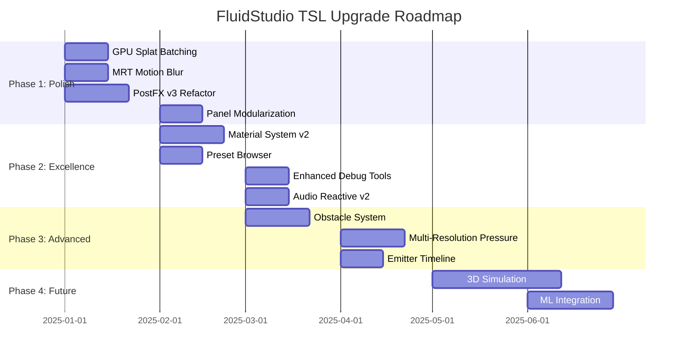

# FluidStudio TSL — "Next Generation" Upgrade Proposal

> **Vision**: Transform Fluidstudio_tsl from a functional fluid simulation into a **professional-grade creative tool** with unmatched visual fidelity, performance scalability, and artistic control.

---

## Current Implementation Assessment

### What's Already Excellent ✅

| Component | Status | Notes |
|-----------|--------|-------|
| **PassGraph Architecture** | Implemented | Dependency-ordered execution with timing |
| **FieldRegistry** | Implemented | Centralized field management with ping-pong |
| **17 Compute Nodes** | Implemented | Full simulation pipeline |
| **RK2/MacCormack Advection** | Implemented | High-quality advection |
| **Curl-Noise Turbulence** | Implemented | Divergence-free turbulence |
| **Dynamic Resolution** | Implemented | FPS-based adaptive scaling |
| **PostFX Pipeline** | Implemented | 8 effects with WebGPU node chain |
| **Rich Emitter System** | Implemented | 7 emitter types (point/line/circle/curve/text/svg/brush) |
| **Zustand Store** | Implemented | History manager + preset system |

### What Needs Polish 🔧

- MRT-based motion blur (planned but not shipped)
- GPU splat batching (high emitter count bottleneck)
- PostFX v2 refactor (scattered grading/LUT logic)
- Panel UX (103KB UnifiedPanel.tsx - needs modularization)

---

## 1) Core Architecture: The Graph Evolution

### 1.1 PassGraph v2: Runtime Graph Editing

**Current**: Static pass registration, no runtime modification

**Upgrade**:
```
┌─────────────────────────────────────────────────────────────┐
│                    PassGraph v2 Features                     │
├─────────────────────────────────────────────────────────────┤
│ • Hot-swap passes without full rebuild                      │
│ • Pass grouping ("sim", "post", "debug")                    │
│ • Conditional execution based on frame budgets              │
│ • GPU timestamp queries for per-pass GPU timing             │
│ • Visual node editor integration (future)                   │
└─────────────────────────────────────────────────────────────┘
```

**Implementation**:
- Add `PassGroup` concept for logical grouping
- Add `PassGraph.replace(id, newPass)` for hot-swap
- Add GPU timestamp queries via `renderer.computeAsync()` patterns
- Expose pass metadata for visual editor consumption

### 1.2 FieldRegistry v2: Smart Resource Management

**Enhancements**:
- **Lazy allocation**: Only create textures when first used
- **Resolution tiers**: Define field LOD levels (e.g., pressure at 50% res)
- **Memory budget tracking**: Total VRAM estimation per field
- **Format auto-selection**: Choose optimal format based on GPU capabilities

```typescript
interface FieldDefinitionV2 extends FieldDefinition {
  resolutionScale?: number;      // 0.5 = half of base resolution
  lazyAllocation?: boolean;      // Create on first access
  memoryPriority?: 'low' | 'medium' | 'high';
  fallbackFormat?: TextureFormat; // If primary format unsupported
}
```

### 1.3 Node Registry: First-Class Plugin System

**Goal**: Enable community/custom compute nodes

```typescript
interface ComputeNodeDefinition {
  id: string;
  label: string;
  category: 'simulation' | 'post' | 'utility' | 'experiment';
  
  inputs: NodeInput[];
  outputs: NodeOutput[];
  params: NodeParam[];
  
  create: (registry: FieldRegistry, config: any) => ComputeNode;
  
  // For visual editor
  icon?: string;
  documentation?: string;
}
```

---

## 2) Simulation Excellence

### 2.1 Physics Fidelity Upgrades

#### A) Staggered Grid (MAC) Support — *Optional, High Impact*

**Current**: Collocated grid (velocity at cell centers)

**Upgrade**: MAC grid with staggered velocity storage
- U-velocity on left/right cell faces
- V-velocity on top/bottom cell faces
- Dramatically improves divergence-free accuracy

| Metric | Collocated | Staggered |
|--------|------------|-----------|
| Divergence Error | Higher | Minimal |
| Vortex Preservation | Moderate | Excellent |
| Implementation Complexity | Low | High |

**Recommendation**: Keep collocated as default, add MAC as opt-in "physics quality" mode.

#### B) Multi-Resolution Pressure Solver

**Current**: Single-resolution Jacobi iterations

**Upgrade**: V-cycle multigrid for pressure
```
Full res → Restrict → Half res → Restrict → Quarter res
    ↑                    ↑                      ↓
Prolong ← Smooth ← Prolong ← Smooth ← Solve
```

**Benefits**:
- 2-4x fewer iterations for same accuracy
- Better handling of large-scale pressure waves
- Predictable convergence

#### C) Temporal Coherence Improvements

- **Timestep substepping**: Already implemented, enhance controls
- **Multiple substeps per display frame**: Decouple sim rate from display rate
- **Simulation interpolation**: Blend between substeps for smoother motion

#### D) Advanced vorticity Confinement

**Current**: Standard curl-based confinement

**Upgrade**:
- **Edge-aware confinement**: Reduce artifacts at boundaries
- **Scale-dependent confinement**: Different strengths at different scales
- **Anisotropic confinement**: Direction-dependent boost

### 2.2 Extended Physics Features

#### A) Obstacle/Solid System

```typescript
interface ObstacleDefinition {
  type: 'circle' | 'box' | 'polygon' | 'sdf';
  position: [number, number];
  velocity?: [number, number]; // For moving obstacles
  temperature?: number;        // For thermal obstacles
  porosity?: number;          // 0 = solid, 1 = fluid, between = porous
}
```

**Implementation**:
- Obstacle SDF texture (signed distance field)
- Boundary condition enforcement in pressure/velocity passes
- Optional obstacle-interaction forces

#### B) Multi-Phase Fluids

**Goal**: Simulate ink/oil/water-like interactions

- Add "phase" scalar field
- Interface tracking via level-set or volume-of-fluid
- Phase-dependent viscosity/diffusion
- Surface tension at interfaces

#### C) Combustion/Reaction System

**Current**: Temperature field exists but limited integration

**Upgrade**:
- Temperature-driven color (heat map)
- Fuel + Temperature → Combustion reaction
- Heat release → Buoyancy boost
- Smoke/soot generation from combustion

---

## 3) Visual Rendering Mastery

### 3.1 Material System v2

#### A) Shader Material Presets

```typescript
interface MaterialPreset {
  id: string;
  name: string;
  category: 'ink' | 'smoke' | 'fire' | 'water' | 'abstract' | 'custom';
  
  // Core shading
  colorMapping: 'density' | 'velocity' | 'vorticity' | 'temperature' | 'gradient';
  gradientTexture?: string;
  lutTexture?: string;
  
  // Surface effects
  normalStrength: number;
  specularIntensity: number;
  fresnelPower: number;
  subsurfaceColor: [number, number, number];
  
  // Edge effects
  edgeIntensity: number;
  edgeColor: [number, number, number];
  foamIntensity: number;
  
  // Environment
  reflectionStrength: number;
  absorptionColor: [number, number, number];
  absorptionDensity: number;
}
```

#### B) Per-Emitter Material Override

**Goal**: Different emitters can inject dye with different "looks"

- Emitter-local color palette
- Emitter-specific material ID (pack into dye alpha)
- Multi-material rendering pass

#### C) Advanced Normal Computation

**Current**: Basic gradient-from-density

**Upgrade**:
- Multi-scale normal blending (fine detail + smooth shapes)
- Velocity-aligned anisotropic filtering
- Fresnel + environment reflection

### 3.2 HDR + Physically-Based Lighting

#### A) HDR Pipeline

```
┌─────────────────────────────────────────────────────────────┐
│   HDR RENDERING PIPELINE                                     │
├─────────────────────────────────────────────────────────────┤
│ 1. Render dye to HDR target (rgba16float)                   │
│ 2. Bloom extraction (threshold → blur → add)                │
│ 3. Tone mapping (ACES Filmic / AgX / Custom curves)         │
│ 4. Color grading (lift/gamma/gain, saturation, hue)         │
│ 5. Output transform (sRGB / Display P3 / Rec.709)           │
└─────────────────────────────────────────────────────────────┘
```

#### B) Lighting System

- **Directional light**: Global shading direction
- **Point lights**: Localized illumination
- **Emissive dye**: Bright fluid that glows (multiplicative with density)

### 3.3 Velocity Visualization Modes

| Mode | Description |
|------|-------------|
| **Streamlines** | Curved lines following flow |
| **Arrows** | Grid of velocity arrows |
| **Noise distortion** | Advected noise texture |
| **Particle traces** | GPU particles following velocity |
| **LIC** | Line Integral Convolution |

---

## 4) PostFX Pipeline v3

### 4.1 Unified Effect Architecture

**Current Issue**: Scattered grading/LUT logic across quad shader and post chain

**Solution**: Single canonical PostFX pipeline

```typescript
// packages/fluid-2d/postfx/PostFXPipelineV3.ts

interface PostEffectDefinition {
  id: string;
  label: string;
  category: 'color' | 'motion' | 'blur' | 'artistic' | 'output';
  
  // Resources
  requiresRenderTargets?: number;
  requiresVelocityBuffer?: boolean;
  requiresDepthBuffer?: boolean;
  
  // Performance hints
  gpuCost: 'low' | 'medium' | 'high';
  recommendedDownscale?: number;
  
  // UI metadata
  params: EffectParam[];
  
  // Build function
  build: (input: ShaderNode, ctx: EffectContext) => ShaderNode;
}
```

### 4.2 New Effect Library

| Effect | Status | Priority |
|--------|--------|----------|
| **MRT Motion Blur** | Planned | 🔴 High |
| **Adaptive Bloom** | Partial | 🟡 Medium |
| **Sharpen/Clarity** | Implemented | ✅ Done |
| **Color LUT** | Implemented | ✅ Done |
| **Halftone/Dither** | New | 🟡 Medium |
| **Trails/AfterImage** | Partial | 🟡 Medium |
| **Selective Color** | New | 🟢 Low |
| **Radial Blur** | New | 🟢 Low |
| **Directional Blur** | New | 🟢 Low |
| **Depth of Field** | New | 🟢 Low |
| **Anamorphic Flares** | New | 🟢 Low |

### 4.3 MRT (Multi-Render-Target) Implementation

**Required for**: Motion blur, DOF, selective effects

```
┌────────────────────────────────────────────────────────────┐
│   MRT OUTPUT TARGETS                                        │
├────────────────────────────────────────────────────────────┤
│ Target 0: Color (rgba16float)                               │
│ Target 1: Velocity (rg16float) - screen-space motion        │
│ Target 2: Aux (rgba8) - material ID, luminance, etc.        │
└────────────────────────────────────────────────────────────┘
```

### 4.4 Effect Stack UI

```
┌────────────────────────────────────────────────────────────┐
│ POST FX STACK                              [+] [Reset]     │
├────────────────────────────────────────────────────────────┤
│ ☐ → 1. Color Grading                              [⚙️] [✕] │
│ ☑ → 2. Bloom (HDR)                    ⚡ High     [⚙️] [✕] │
│ ☑ → 3. Motion Blur                    🎬 MRT     [⚙️] [✕] │
│ ☐ → 4. Chromatic Aberration                       [⚙️] [✕] │
│ ☑ → 5. Film Grain                                 [⚙️] [✕] │
├────────────────────────────────────────────────────────────┤
│ [A/B Bypass] [Solo Selected] [GPU Cost: 2.3ms]             │
└────────────────────────────────────────────────────────────┘
```

---

## 5) Studio UX Revolution

### 5.1 Panel Architecture Refactor

**Current Issue**: UnifiedPanel.tsx is 103KB monolith

**Solution**: Modular panel system

```
packages/studio/panels/
├── PanelContainer.tsx          # Layout + docking
├── PanelProvider.tsx           # State management
├── sections/
│   ├── SimulationSection.tsx   # Physics controls
│   ├── EmitterSection.tsx      # Emitter management
│   ├── MaterialSection.tsx     # Dye appearance
│   ├── PostFXSection.tsx       # Effect stack
│   ├── DebugSection.tsx        # Field visualization
│   ├── PerformanceSection.tsx  # HUD + profiling
│   └── PresetsSection.tsx      # Preset browser
└── controls/
    ├── SliderControl.tsx
    ├── ColorControl.tsx
    ├── VectorControl.tsx
    └── GradientControl.tsx
```

### 5.2 Preset System v2

#### A) Preset Categories

```typescript
interface PresetV2 {
  id: string;
  name: string;
  author?: string;
  tags: string[];
  category: 'simulation' | 'visual' | 'postfx' | 'complete';
  
  thumbnail?: string;  // Base64 or URL
  
  // Partial configs - only override what's specified
  simulation?: Partial<FluidConfig2D>;
  material?: Partial<MaterialConfig>;
  postfx?: Partial<PostFXConfig>;
  emitters?: EmitterPreset[];
}
```

#### B) Preset Browser

- Grid/list view toggle
- Category filtering
- Tag search
- Thumbnail previews
- One-click apply with undo

### 5.3 Emitter Enhancement

#### A) Emitter Timeline

```
Time →  0s        2s        4s        6s        8s
        ├─────────┼─────────┼─────────┼─────────┤
Emit 1  ██████████████████████████████████████████ (continuous)
Emit 2  ▓▓▓▓▓▓    ▓▓▓▓▓▓    ▓▓▓▓▓▓    ▓▓▓▓▓▓     (pulse)
Emit 3            ████████████████                 (burst)
```

#### B) Emitter Keyframe Animation

- Position/rotation/scale over time
- Color/intensity over time
- Spline path following
- Beat-sync for audio reactive

#### C) Emitter Instancing

- Array patterns (grid, radial, spiral)
- Random distribution with seed
- Per-instance parameter variation

### 5.4 Audio Reactive v2

**Current**: Basic analyzer integration

**Upgrade**:
- **Multi-band analysis**: Bass/mid/high separation
- **Beat detection**: BPM estimation + beat triggers
- **Envelope followers**: Smooth attack/release
- **FFT visualization**: Spectrum display in UI
- **Per-emitter audio bindings**: Map audio features to parameters

---

## 6) Performance Optimization

### 6.1 GPU Splat Batching

**Current Issue**: CPU→GPU splat submission bottleneck with many emitters

**Solution**: GPU-side splat list

```typescript
interface SplatBatch {
  buffer: GPUBuffer;  // Packed splat data
  count: number;
  
  // Each splat: position(2) + velocity(2) + color(4) + radius(1) + intensity(1)
  // = 10 floats = 40 bytes per splat
}

// Compute kernel processes all splats in parallel
const batchedSplatKernel = Fn(() => {
  const splatIdx = instanceIndex;
  const splat = loadSplat(splatBuffer, splatIdx);
  // Apply splat to nearby cells using atomics or scatter
});
```

### 6.2 Temporal Reprojection

- Reuse previous frame data for expensive effects
- Motion-vector-based reprojection
- Confidence-weighted blending

### 6.3 Resolution Scaling v2

| Quality Level | Grid | Dye | PostFX | Target FPS |
|--------------|------|-----|--------|------------|
| **Ultra** | 1024 | 2048 | 1.0x | 30 |
| **High** | 512 | 1024 | 1.0x | 60 |
| **Medium** | 384 | 768 | 0.75x | 60 |
| **Low** | 256 | 512 | 0.5x | 60 |
| **Adaptive** | Auto | Auto | Auto | Target |

### 6.4 Compute Pass Merging

- Combine compatible passes to reduce dispatch overhead
- Example: Vorticity compute + confinement force in one kernel

---

## 7) Developer Experience

### 7.1 Debug Tooling

#### A) Enhanced Field Viewer

```
┌────────────────────────────────────────────────────────────┐
│ FIELD DEBUG VIEWER                           [Solo] [Lock] │
├────────────────────────────────────────────────────────────┤
│ Field: [velocity ▼]  ColorMap: [divergent ▼]  Scale: [10.0]│
│                                                            │
│ Stats: min=-2.34  max=5.67  mean=0.12  L2=1.234           │
│ Resolution: 512x512  Format: rgba16float                   │
└────────────────────────────────────────────────────────────┘
```

#### B) Pass Graph Visualizer

- Interactive node graph showing pass dependencies
- Live timing display per node
- Click to enable/disable passes
- Hover for pass details

#### C) GPU Profiler Integration

```
┌────────────────────────────────────────────────────────────┐
│ GPU PROFILER                                  [🔴 Record]  │
├────────────────────────────────────────────────────────────┤
│ Pass                          │ GPU Time │ % Total        │
│ ─────────────────────────────│──────────│────────────────│
│ advect_velocity               │   0.42ms │ ████░░░░ 12%  │
│ pressure_jacobi (x20)         │   1.85ms │ ██████████ 52%│
│ advect_dye                    │   0.68ms │ █████░░░░ 19% │
│ post_bloom                    │   0.34ms │ ███░░░░░░ 10% │
│ post_grain                    │   0.12ms │ █░░░░░░░░  3% │
├────────────────────────────────────────────────────────────┤
│ Total: 3.54ms (282 FPS theoretical)                        │
└────────────────────────────────────────────────────────────┘
```

### 7.2 API Documentation

- TypeDoc-generated API reference
- Interactive examples (Storybook-style)
- Code snippets for common tasks

### 7.3 Testing Infrastructure

| Test Type | Coverage Goal |
|-----------|--------------|
| Unit tests (Vitest) | Core utilities, math helpers |
| Visual regression | Key render outputs |
| Performance baselines | FPS targets per quality level |
| Browser compatibility | Chrome, Edge, Firefox (WebGPU) |

---

## 8) Advanced Features (Phase 4+)

### 8.1 3D Fluid Simulation

- Extend PassGraph/FieldRegistry to 3D StorageTexture3D
- Volume raymarching renderer
- 3D emitter types

### 8.2 Particle-Fluid Coupling

- GPU particle system
- Two-way coupling with velocity field
- FLIP/PIC hybrid methods

### 8.3 Machine Learning Integration

- Neural style transfer on dye output
- Learned upscaling (super-resolution)
- AI-generated color palettes

### 8.4 Export & Rendering

- High-resolution offline rendering
- Video export (WebCodecs)
- Image sequence export
- glTF/USD scene export

---

## 9) Production Readiness

### 9.1 Error Handling

```typescript
// Graceful degradation
try {
  await renderer.init();
} catch (e) {
  if (e instanceof WebGPUNotSupportedError) {
    showFallbackUI();
  } else if (e instanceof DeviceLostError) {
    await attemptRecovery();
  }
}
```

### 9.2 Telemetry & Analytics

- Performance metrics collection (opt-in)
- Error reporting
- Feature usage tracking

### 9.3 Deployment Options

| Target | Notes |
|--------|-------|
| Web (standalone) | Vite build, static hosting |
| Web (embedded) | NPM package for integration |
| Electron | Desktop app with file system access |
| Capacitor | Mobile wrapper (WebGPU permitting) |

---

## Implementation Roadmap



---

## Priority Matrix

| Feature | Impact | Effort | Priority |
|---------|--------|--------|----------|
| GPU Splat Batching | 🔴 High | Medium | **P0** |
| MRT Motion Blur | 🔴 High | Medium | **P0** |
| PostFX Pipeline v3 | 🔴 High | Large | **P0** |
| Panel Modularization | 🟡 Medium | Medium | **P1** |
| Material Presets | 🟡 Medium | Medium | **P1** |
| Preset Browser | 🟡 Medium | Small | **P1** |
| Debug Pass Graph | 🟡 Medium | Medium | **P1** |
| Obstacle System | 🟡 Medium | Large | **P2** |
| Multigrid Pressure | 🟢 Low | Large | **P2** |
| Staggered Grid | 🟢 Low | Very Large | **P3** |
| 3D Simulation | 🟢 Low | Very Large | **P4** |

---

## Acceptance Criteria

### Visual Excellence
- [ ] 5+ distinct "hero looks" achievable via presets (ink, neon, smoke, fire, abstract)
- [ ] Motion blur indistinguishable from reference film footage
- [ ] HDR bloom that doesn't clip or wash out

### Performance
- [ ] 60 FPS at 512x512 grid + 1024 dye on target hardware
- [ ] <16ms total frame time with full PostFX stack
- [ ] 100+ simultaneous emitters without CPU bottleneck

### Usability
- [ ] New user can achieve compelling results in <2 minutes
- [ ] All panel sections independently collapsible/expandable
- [ ] Ctrl+Z/Ctrl+Y work for all parameter changes

### Stability
- [ ] No WebGPU device-lost crashes in normal operation
- [ ] Graceful fallback messaging when WebGPU unavailable
- [ ] All presets load/apply without errors

---

## Appendix: File Reference

| Component | Path | Lines |
|-----------|------|-------|
| FluidSolver2D | `packages/fluid-2d/FluidSolver2D.ts` | 1381 |
| PassGraph | `packages/fluid-2d/core/PassGraph.ts` | 298 |
| FieldRegistry | `packages/fluid-2d/core/FieldRegistry.ts` | 364 |
| FluidCanvas2D | `packages/fluid-2d/components/FluidCanvas2D.tsx` | ~1500 |
| PostFXPipeline | `packages/fluid-2d/postfx/PostFXPipeline2D.ts` | ~400 |
| UnifiedPanel | `packages/studio/panels/UnifiedPanel.tsx` | ~2500 |
| StudioStore | `packages/studio/store/studioStore.ts` | ~400 |
| EmitterManager | `packages/fluid-2d/emitters/EmitterManager.ts` | ~900 |
